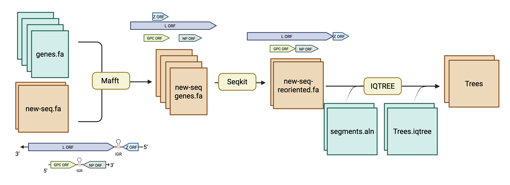

# Joon-Klaps/lasvphylo v2.0

[](https://github.com/Joon-Klaps/lasvphylo/actions/workflows/nf-test.yml)
[](https://github.com/Joon-Klaps/lasvphylo/actions/workflows/linting.yml)
[](https://www.nf-test.com)

[](https://www.nextflow.io/)
[](https://github.com/nf-core/tools/releases/tag/3.5.1)
[](https://docs.conda.io/en/latest/)
[](https://www.docker.com/)
[](https://sylabs.io/docs/)
[](https://cloud.seqera.io/launch?pipeline=https://github.com/Joon-Klaps/lasvphylo)

## Introduction

**lasvphylo** is a pipeline for creating a high quality alignment of LASV segements and a maximum likelihood tree. I use this pipeline for a fast phylogentic analysis of newly identified LASV cases/outbreaks to determine the rise of new clades or interesting mutations.

[](docs/images/Workflow.png)

## Pipeline summary

1. Orient and isolate the genes of LASV ([`MAFFT`](https://mafft.cbrc.jp/alignment/software/))
2. Remove the reference sequences from the alignment ([`SeqTk`](https://github.com/lh3/seqtk))
3. Concatenate the genes to each other ([`SeqKit`](https://bioinf.shenwei.me/seqkit/))
4. Perform a **constrained** tree search using a previous tree and new sequences ([`IQ-TREE`](http://www.iqtree.org/))

## Quick Start

1. Install [`Nextflow`](https://www.nextflow.io/docs/latest/getstarted.html#installation) (`>=25.04.0`)

2. Install any of [`Docker`](https://docs.docker.com/engine/installation/), [`Singularity`](https://www.sylabs.io/guides/3.0/user-guide/) (you can follow [this tutorial](https://singularity-tutorial.github.io/01-installation/)) or [`Conda`](https://conda.io/miniconda.html).

3. Download the pipeline (git clone) and give in the correct variables :

   ```bash
   nextflow run Joon-Klaps/lasvphylo -profile <docker|conda|singularity> -c <CONFIG> --outdir <OUTDIR>
   ```

Where `<CONFIG>` is a configuration file (see `conf/` for examples) and `<OUTDIR>` is the desired output directory.

Example configuration file:

```groovy
params {
    // Maximum resource limits
    max_cpus   = 6
    max_memory = '8.GB'
    max_time   = '1.h'

    // Necessary inputs
    input_L      = '/path/to/input/sequences.L.fasta'
    input_S      = '/path/to/input/sequences.S.fasta'

    // Optional Inputs - if none provided, everything will be run from scratch
    alignment_L = '/path/to/existing/alignment.L.fasta'
    alignment_S = '/path/to/existing/alignment.S.fasta'
    tree_L      = '/path/to/existing/tree.L.treefile'
    tree_S      = '/path/to/existing/tree.S.treefile'

    // Output directory
    outdir      = 'testing'
}
```
